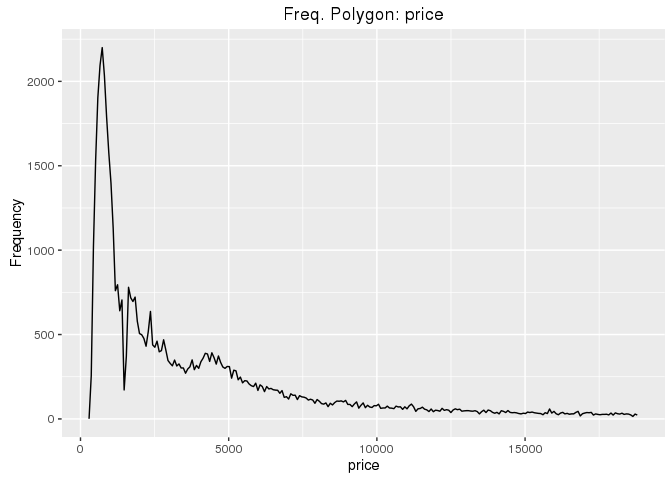
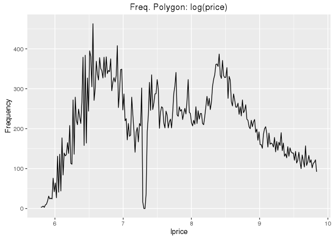
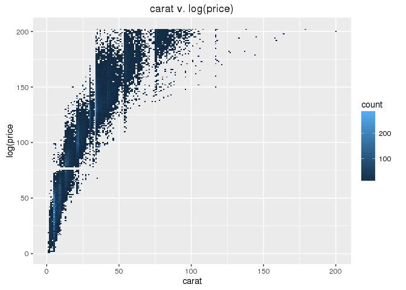
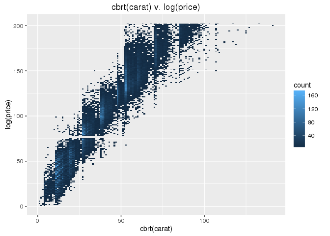
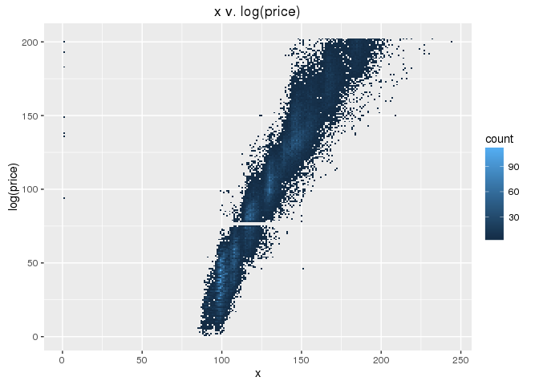
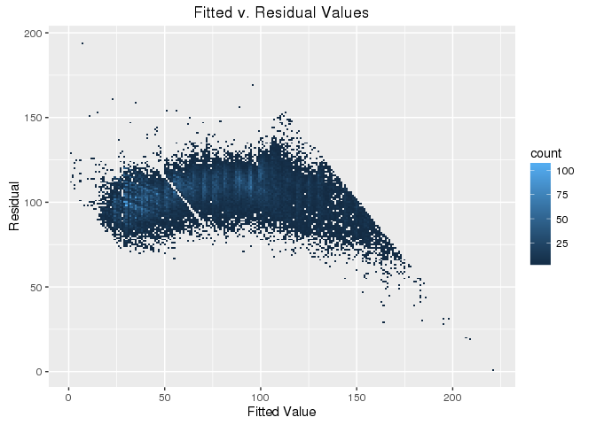
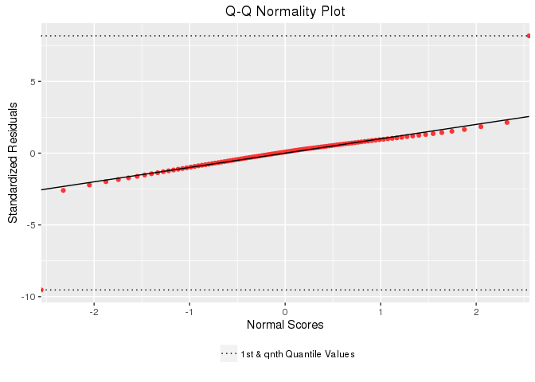

# Fitting Generalized Linear Models in SparkR
Sarah Armstrong, Urban Institute  
August 30, 2016  


**Objective**: In this tutorial, we provide examples of steps that researchers may take to fit generalized linear models (GLMs) using SparkR. In particular, the tutorial discusses how to:

* Examine the data prior to model fitting & perform data transformations
* Fit a Gaussian distribution GLM with the identity link function
    + Print the summary of the model
    + Compute general linear model measurements from Gaussian/identity GLM
    + Calculate fitted values from the model
    + Compute sum of squared totals and residuals
    + Compute R-squared and adjusted R-squared
    + Fit Gaussian/identity GLM and general linear model in R for comparison
* Fit the other GLM distribution families supported by SparkR
    + Create a binary response variable for logistic regression model
    + Fit binomial, Gamma and Poisson GLMs in SparkR
* Graphical linear model diagnostics
    + Fitted v. residual values plot
    + Q-Q normality plot of the standardized residuals

**SparkR/R Operations Discussed**: `histogram`, `withColumn`, `geom_bivar_histogram.SparkR` (defined function), `spark.glm`, `summary`, `confint.SparkR` (defined function), `predict`, `transform`, `glm` (`R`), `lm` (`R`), `mutate`, `qqnorm.SparkR` (defined function)

***

:heavy_exclamation_mark: **Warning**: Before beginning this tutorial, please visit the SparkR Tutorials README file (found [here](https://github.com/UrbanInstitute/sparkr-tutorials/blob/master/README.md)) in order to load the SparkR library and subsequently initiate a SparkR session.


The following error indicates that you have not initiated a SparkR session:


```r
Error in getSparkSession() : SparkSession not initialized
```

If you receive this message, return to the SparkR tutorials [README](https://github.com/UrbanInstitute/sparkr-tutorials/blob/master/README.md) for guidance.


***


**Read in initial data as DataFrame (DF)**: Throughout this tutorial, we will use the diamonds data that is included in the `ggplot2` package.


```r
df <- read.df("s3://ui-spark-data/diamonds.csv", header = "true", delimiter = ",",
              source = "csv", inferSchema = "true", na.strings = "")

cache(df)
```

_Note_: A description of the `diamonds` data can be found at http://ggplot2.org/book/qplot.pdf.


***


### Examine data prior to model fitting & perform data transformations

The aim of this tutorial is to provide examples of how to fit a generalized linear model and check model diagnostics in SparkR, rather than to provide a comprehensive discussion of model selection. Consequently, while we will discuss how to examine the data prior to model fitting (and how researchers may use these procedures to inform them about model fitting), we will not discuss feature selection frameworks (e.g. forward selection) in this tutorial. We assume `"price"` as our response, and `"carat"`, `"x"` and `"clarity"` as our predictor variables.

We begin by visually examining the distribution of `"price"`. The SparkR `histogram` operation creates a local data.frame that computes centroid and count values for a given number of histogram bins, which we can specify with the `nbins` parameter.


```r
hstats1 <- histogram(df, "price", nbins = 250)
head(hstats1)
##   bins counts centroids
## 1   -1      1   289.006
## 2    0    257   362.994
## 3    1   1022   436.982
## 4    2   1532   510.970
## 5    3   1903   584.958
## 6    4   2095   658.946
```

We can use these aggregrations to easily plot a frequency polygon using `ggplot2`:


```r
x <- "price"
title <- "Freq. Polygon: price"

p1 <- ggplot(hstats1, aes(x = centroids, y = counts)) + geom_path() + xlab(x) + ylab("Frequency") + ggtitle(title)
p1
```

<!-- -->

We can see in the plot above that `"price"` is very right-skewed. We can reduce this skewness by performing a log transformation on the `"price"` column. Below, we create a new variable in `df` that lists the log values of `"price"`, named `"lprice"`:


```r
df <- withColumn(df, "lprice", log(df$price))
```

Performing the same plotting procedure as before, we can see the the log-transformation clearly reduces the the skewness of the variable. We will use `"lprice"` as the response variable when fitting our model.


```r
hstats2 <- histogram(df, "lprice", nbins = 250)

x <- "lprice"
title <- "Freq. Polygon: log(price)"

p2 <- ggplot(hstats2, aes(x = centroids, y = counts)) + geom_path() + xlab(x) + ylab("Frequency") + ggtitle(title)
p2
```

<!-- -->

We will now examine the relationship between our numerical predictor variables (`"carat"` and `"x"`) and the response (`"lprice"`). If our data was able to fit onto a single node, we would use scatterplots to visually examine how two numerical variables correlate. Here, we will instead use the `geom_bivar_histogram.SparkR` function that we first discussed in the [Data Visualizations](https://github.com/UrbanInstitute/sparkr-tutorials/blob/master/visualizations.md#bivariate-histogram) tutorial. Documentation for the bivariate histogram function can be found [here](https://github.com/UrbanInstitute/sparkr-tutorials/blob/master/R/geom_bivar_histogram_SparkR.R). The function is given below:


```r
geom_bivar_histogram.SparkR <- function(df, x, y, nbins){
  
  library(ggplot2)
  
  x_min <- collect(agg(df, min(df[[x]])))
  x_max <- collect(agg(df, max(df[[x]])))
  x.bin <- seq(floor(x_min[[1]]), ceiling(x_max[[1]]), length = nbins)
  
  y_min <- collect(agg(df, min(df[[y]])))
  y_max <- collect(agg(df, max(df[[y]])))
  y.bin <- seq(floor(y_min[[1]]), ceiling(y_max[[1]]), length = nbins)
  
  x.bin.w <- x.bin[[2]]-x.bin[[1]]
  y.bin.w <- y.bin[[2]]-y.bin[[1]]
  
  df_ <- withColumn(df, "x_bin_", ceiling((df[[x]] - x_min[[1]]) / x.bin.w))
  df_ <- withColumn(df_, "y_bin_", ceiling((df[[y]] - y_min[[1]]) / y.bin.w))
  
  df_ <- mutate(df_, x_bin = ifelse(df_$x_bin_ == 0, 1, df_$x_bin_))
  df_ <- mutate(df_, y_bin = ifelse(df_$y_bin_ == 0, 1, df_$y_bin_))
  
  dat <- collect(agg(groupBy(df_, "x_bin", "y_bin"), count = n(df_$x_bin)))
  
  p <- ggplot(dat, aes(x = x_bin, y = y_bin, fill = count)) + geom_tile()
  
  return(p)
}
```

Below, we fit a bivariate histogram between `"carat"` and `"lprice"`:


```r
p3 <- geom_bivar_histogram.SparkR(df = df, x = "carat", y = "lprice", nbins = 250)
p3 + scale_colour_brewer(palette = "Blues", type = "seq") + xlab("carat") + ylab("log(price") + 
  ggtitle("carat v. log(price)")
```

<!-- -->

We can see from the plot that the relationship between the two variables is clearly not linear, and the plot suggests a polynomial relationship between `"carat"` and `"lprice"`. In fact, re-plotting the bivariate histogram after performing a cube-root transformation on `"carat"`, suggests that the relationship between `"lprice"` and `"cbrt_carat"` is relatively more linear. We will include `"cbrt_carat"` as a predictor in our model.


```r
df <- withColumn(df, "cbrt_carat", cbrt(df$carat))

p4 <- geom_bivar_histogram.SparkR(df = df, x = "cbrt_carat", y = "lprice", nbins = 250)
p4 + scale_colour_brewer(palette = "Blues", type = "seq") + xlab("cbrt(carat)") + ylab("log(price)") + 
  ggtitle("cbrt(carat) v. log(price)")
```

<!-- -->

Finally, we plot a bivariate histogram between `"lprice"` and `"x"`, which indicates an approximately linear relationship between the two variables.


```r
p5 <- geom_bivar_histogram.SparkR(df = df, x = "x", y = "lprice", nbins = 250)
p5 + scale_colour_brewer(palette = "Blues", type = "seq") + xlab("x") + ylab("log(price)") + ggtitle("x v. log(price)")
```

<!-- -->

[Insert: Fit box-plot for categorical v. continuous variable ("lprice" v. "clarity") when available.]


***


### Fit Generalized Linear Model

The SparkR syntax for fitting a GLM is very similar to that in R. The operation `spark.glm` uses the same symbolic description of the model as the R `glm` function (e.g. `~`, `+`, `:`, `-`, `.`).

We fit a Gaussian family GLM with the identity link function below:


```r
lm1 <- spark.glm(df, lprice ~ cbrt_carat + x + clarity, family = "gaussian")
```


#### Print model summary


Additionally, the SparkR operation for printing the summary of a fit model is identical to that used in R:


```r
output1 <- summary(lm1)
output1
## 
## Deviance Residuals: 
## (Note: These are approximate quantiles with relative error <= 0.01)
##      Min        1Q    Median        3Q       Max  
## -2.08746  -0.13394   0.01647   0.14622   1.79113  
## 
## Coefficients:
##               Estimate  Std. Error  t value  Pr(>|t|)
## (Intercept)   1.6958    0.010156    166.97   0       
## cbrt_carat    5.3231    0.053611    99.291   0       
## x             0.10077   0.0083662   12.045   0       
## clarity_SI1   0.66747   0.0083193   80.232   0       
## clarity_VS2   0.80323   0.00836     96.081   0       
## clarity_SI2   0.50828   0.0083792   60.659   0       
## clarity_VS1   0.84749   0.0084877   99.849   0       
## clarity_VVS2  0.9844    0.008745    112.57   0       
## clarity_VVS1  1.0178    0.0089928   113.18   0       
## clarity_IF    1.1009    0.0097274   113.17   0       
## 
## (Dispersion parameter for gaussian family taken to be 0.04798318)
## 
##     Null deviance: 55530.9  on 53939  degrees of freedom
## Residual deviance:  2587.7  on 53930  degrees of freedom
## AIC: -10724
## 
## Number of Fisher Scoring iterations: 1
```

The summary table includes many of the essential GLM measures used to assess the goodness of fit of a model. We can also extract components of the GLM summary table with the following expressions:


```r
coeffs1 <- output1$coefficients[,1]
coeffs1
## $`(Intercept)`
## [1] 1.695786
## 
## $cbrt_carat
## [1] 5.323141
## 
## $x
## [1] 0.1007718
## 
## $clarity_SI1
## [1] 0.6674668
## 
## $clarity_VS2
## [1] 0.803235
## 
## $clarity_SI2
## [1] 0.5082786
## 
## $clarity_VS1
## [1] 0.8474911
## 
## $clarity_VVS2
## [1] 0.9844045
## 
## $clarity_VVS1
## [1] 1.017788
## 
## $clarity_IF
## [1] 1.10086

std_err1 <- output1$coefficients[,2]
tvalue1 <- output1$coefficients[,3]
```

Additionally, we can compute confidence intervals for a Gaussian GLM with the identity link function using the `confint.SparkR` function given below. Documentation for the function can be found [here](https://github.com/UrbanInstitute/sparkr-tutorials/blob/master/R/confint_SparkR.R).


```r
confint.SparkR <- function(object, level){
  
  coef <- unname(unlist(summary(object)$coefficients[,1]))
  
  err <- unname(unlist(summary(object)$coefficients[,2]))
  
  ci <- as.data.frame(cbind(names(unlist(summary(object)$coefficients[,1])), coef - err*qt(level, summary(object)$df.null), coef + err*qt(0.975, summary(object)$df.null)))
  
  colnames(ci) <- c("","Lower Bound", "Upper Bound")
  
  return(ci)
  
}
```

Below, we construct 95% level confidence intervals for the parameter estimates of `lm1`:


```r
ci1 <- confint.SparkR(object = lm1, level = 0.975)
ci1
##                       Lower Bound       Upper Bound
## 1   (Intercept)  1.67587915505849  1.71569278128202
## 2    cbrt_carat  5.21806223537838  5.42821957710459
## 3             x 0.084374002912062 0.117169565629144
## 4   clarity_SI1  0.65116096126798  0.68377258985223
## 5   clarity_VS2 0.786849287986761 0.819620675118446
## 6   clarity_SI2 0.491855238862335 0.524701886475937
## 7   clarity_VS1 0.830855041810246 0.864127120031304
## 8  clarity_VVS2 0.967264241524662  1.00154468922489
## 9  clarity_VVS1   1.0001621361418  1.03541398177766
## 10   clarity_IF  1.08179379698854  1.11992535344802
```


#### General linear model measurements from Gaussian/identity GLM


While SparkR does not support a function to fit a general linear model (e.g. `lm` in R), we can use `spark.glm`, with the Gaussian family and identity link function, to fit a linear regression model (if that the necessary assumptions are satisfied). In this case, the `spark.glm` and `glm` functions will return the same parameter estimates, std. errors and t-values as the `lm` R function.


Computationally, differences may arise due to GLMs being fit using iteratively reweighted least squares (IRLS) in `glm` and `spark.glm`, rather than with Q-R factorization as in `lm`. Additionally, confidence intervals (CIs) for GLM parameter estimates should be computed using the normal distribution, rather than with the t-distribution as is the case for linear regression parameter estimates. However, this should not impact the CI ranges significantly since the t-distribution converges to the standard normal as sample size goes to infinity. Most data sets that would require researchers to use SparkR should be large enough that this should not greatly impact results.


Below, we assign the `"lprice"` column to `y` so that we can easily reference the column in the code that follows, and also compute the average `"lprice"` value, which we will use in subsequent calculations.


```r
y <- df$lprice
y_avg <- collect(agg(df, y_avg = mean(y)))$y_avg
```


#### Calculate fitted values from model


Again, the syntax for returning the fitted values of the model (before applying the inverse of the link function) is identical to that of R. Here, we can see that the operation `predict` appends a column named `"prediction"` to the DF with the fitted model values:


```r
df <- predict(lm1, df)
head(df)
##   carat       cut color clarity depth table price    x    y    z   lprice
## 1  0.23     Ideal     E     SI2  61.5    55   326 3.95 3.98 2.43 5.786897
## 2  0.21   Premium     E     SI1  59.8    61   326 3.89 3.84 2.31 5.786897
## 3  0.23      Good     E     VS1  56.9    65   327 4.05 4.07 2.31 5.789960
## 4  0.29   Premium     I     VS2  62.4    58   334 4.20 4.23 2.63 5.811141
## 5  0.31      Good     J     SI2  63.3    58   335 4.34 4.35 2.75 5.814131
## 6  0.24 Very Good     J    VVS2  62.8    57   336 3.94 3.96 2.48 5.817111
##   cbrt_carat    label prediction
## 1  0.6126926 5.786897   5.863562
## 2  0.5943922 5.786897   5.919288
## 3  0.6126926 5.789960   6.212852
## 4  0.6619106 5.811141   6.445706
## 5  0.6767899 5.814131   6.244062
## 6  0.6214465 5.817111   6.385279
```


#### Compute sum of squared totals and residuals


Below, we use the `transform` operation to append the following values to the DF:

* `"y_hat"`: fitted values of the model
* `"sq_res"`: squared residual values
* `"sq_tot"`: squared total values
* `"res"`: residual values


```r
df <- transform(df, y_hat = df$prediction, sq_res = (y - df$prediction)^2, sq_tot = (y - y_avg)^2, res = y - df$prediction)

df$prediction <- NULL

head(select(df, "y", "y_hat", "sq_res", "sq_tot"))
##      y    y_hat      sq_res   sq_tot
## 1 3.98 5.863562 0.005877456 3.999484
## 2 3.84 5.919288 0.017527380 3.999484
## 3 4.07 6.212852 0.178837198 3.987243
## 4 4.23 6.445706 0.402672503 3.903104
## 5 4.35 6.244062 0.184841340 3.891300
## 6 3.96 6.385279 0.322814189 3.879550
```

Next, we compute the sum of the squared residuals and squared totals:


```r
SSR <- collect(agg(df, SSR = sum(df$sq_res)))
SST <- collect(agg(df, SST = sum(df$sq_tot)))

SSR
##        SSR
## 1 2587.733
SST
##        SST
## 1 55530.92
```


#### Compute R-squared and adjusted R-squared


Using these values, we can easily calculate the R-squared and adjusted R-squared values for the model:


```r
Rsq <- 1-(SSR[[1]]/SST[[1]])
p <- 10
N <- nrow(df)
aRsq <- Rsq - (1 - Rsq)*((p - 1)/(N - p))

Rsq
## [1] 0.9534001
aRsq
## [1] 0.9533924
```


#### Fit Gaussian/identity GLM and general linear model in R for comparison


Next we collect the diamonds data as a local data.frame so that we can fit the same GLM using `glm` from R and fit a linear regression model using `lm` to compare model output values with those computed using `spark.glm`:


```r
dat <- collect(df)
head(dat)
##   carat       cut color clarity depth table price    x    y    z   lprice
## 1  0.23     Ideal     E     SI2  61.5    55   326 3.95 3.98 2.43 5.786897
## 2  0.21   Premium     E     SI1  59.8    61   326 3.89 3.84 2.31 5.786897
## 3  0.23      Good     E     VS1  56.9    65   327 4.05 4.07 2.31 5.789960
## 4  0.29   Premium     I     VS2  62.4    58   334 4.20 4.23 2.63 5.811141
## 5  0.31      Good     J     SI2  63.3    58   335 4.34 4.35 2.75 5.814131
## 6  0.24 Very Good     J    VVS2  62.8    57   336 3.94 3.96 2.48 5.817111
##   cbrt_carat    label    y_hat      sq_res   sq_tot         res
## 1  0.6126926 5.786897 5.863562 0.005877456 3.999484 -0.07666457
## 2  0.5943922 5.786897 5.919288 0.017527380 3.999484 -0.13239101
## 3  0.6126926 5.789960 6.212852 0.178837198 3.987243 -0.42289147
## 4  0.6619106 5.811141 6.445706 0.402672503 3.903104 -0.63456481
## 5  0.6767899 5.814131 6.244062 0.184841340 3.891300 -0.42993179
## 6  0.6214465 5.817111 6.385279 0.322814189 3.879550 -0.56816740
```

After fitting the same GLM (Gaussian with identity link function) and the associated linear regression model in R, we compare the outputs below:


```r
lm2 <- glm(lprice ~ cbrt_carat + x + clarity, data = dat, family = gaussian)
output2 <- summary(lm2)

lm3 <- lm(lprice ~ cbrt_carat + x + clarity, data = dat)
output3 <- summary(lm3)

output2
## 
## Call:
## glm(formula = lprice ~ cbrt_carat + x + clarity, family = gaussian, 
##     data = dat)
## 
## Deviance Residuals: 
##      Min        1Q    Median        3Q       Max  
## -2.08746  -0.13746   0.01845   0.15069   1.79113  
## 
## Coefficients:
##             Estimate Std. Error t value Pr(>|t|)    
## (Intercept) 1.695786   0.010156  166.97   <2e-16 ***
## cbrt_carat  5.323141   0.053611   99.29   <2e-16 ***
## x           0.100772   0.008366   12.04   <2e-16 ***
## clarityIF   1.100860   0.009727  113.17   <2e-16 ***
## claritySI1  0.667467   0.008319   80.23   <2e-16 ***
## claritySI2  0.508279   0.008379   60.66   <2e-16 ***
## clarityVS1  0.847491   0.008488   99.85   <2e-16 ***
## clarityVS2  0.803235   0.008360   96.08   <2e-16 ***
## clarityVVS1 1.017788   0.008993  113.18   <2e-16 ***
## clarityVVS2 0.984404   0.008745  112.57   <2e-16 ***
## ---
## Signif. codes:  0 '***' 0.001 '**' 0.01 '*' 0.05 '.' 0.1 ' ' 1
## 
## (Dispersion parameter for gaussian family taken to be 0.04798318)
## 
##     Null deviance: 55530.9  on 53939  degrees of freedom
## Residual deviance:  2587.7  on 53930  degrees of freedom
## AIC: -10724
## 
## Number of Fisher Scoring iterations: 2

output3
## 
## Call:
## lm(formula = lprice ~ cbrt_carat + x + clarity, data = dat)
## 
## Residuals:
##      Min       1Q   Median       3Q      Max 
## -2.08746 -0.13746  0.01845  0.15069  1.79113 
## 
## Coefficients:
##             Estimate Std. Error t value Pr(>|t|)    
## (Intercept) 1.695786   0.010156  166.97   <2e-16 ***
## cbrt_carat  5.323141   0.053611   99.29   <2e-16 ***
## x           0.100772   0.008366   12.04   <2e-16 ***
## clarityIF   1.100860   0.009727  113.17   <2e-16 ***
## claritySI1  0.667467   0.008319   80.23   <2e-16 ***
## claritySI2  0.508279   0.008379   60.66   <2e-16 ***
## clarityVS1  0.847491   0.008488   99.85   <2e-16 ***
## clarityVS2  0.803235   0.008360   96.08   <2e-16 ***
## clarityVVS1 1.017788   0.008993  113.18   <2e-16 ***
## clarityVVS2 0.984404   0.008745  112.57   <2e-16 ***
## ---
## Signif. codes:  0 '***' 0.001 '**' 0.01 '*' 0.05 '.' 0.1 ' ' 1
## 
## Residual standard error: 0.2191 on 53930 degrees of freedom
## Multiple R-squared:  0.9534,	Adjusted R-squared:  0.9534 
## F-statistic: 1.226e+05 on 9 and 53930 DF,  p-value: < 2.2e-16
```

We can see that the `glm` and `lm` model summaries include parameter estimates, std. errors and t-values that are equal to those of `spark.glm`, save for differences in rounding. Additionally, the R-squared and adjusted R-squared values that we previously calculated are exactly equal to those computed in `lm`:


```r
Rsq
## [1] 0.9534001
output3$r.squared
## [1] 0.9534001

aRsq
## [1] 0.9533924
output3$adj.r.squared
## [1] 0.9533924
```


***


### Fit other GLM distribution families supported by SparkR

Here we provide examples for each of the distribution and link function pairings currently supported by SparkR. The following error distribution families are available with the associated link functions:

* `gaussian`: identity
* `binomial`: logit
* `poisson`: log
* `gamma`: inverse


#### Create binary response variable


Before proceeding with the examples, we first create an indicator variable to use as the response variable for our logistic regression model. We first compute the average `"lprice"` value, and then use the `mutate` operation with an `ifelse` statement to create a binary variable equal to one (1) if the `"lprice"` is greater than or equal to the average `"lprice"` value, and equal to zero otherwise:


```r
lprice_avg <- collect(agg(df, avg = avg(df$lprice)))[[1]]

df <- mutate(df, lprice_high = ifelse(df$lprice > lprice_avg, lit(1), lit(0)))
```


#### Fit binomial, Gamma and Poisson GLMs in SparkR


Examples of how we would fit each of the described error distribution families and their associated link functions are given below:


```r
# binomial with "logit" link
glm.logit <- spark.glm(df, lprice_high ~ cbrt_carat + x + clarity, family = "binomial")

# Gamma with "inverse" link
glm.gamma <- spark.glm(df, lprice ~ cbrt_carat + x + clarity, family = "Gamma")

# poisson with "log" link
glm.poisson <- spark.glm(df, price ~ cbrt_carat + x + clarity, family = "poisson")
```


***


### Linear model diagnostics

Finally, we discuss strategies for checking whether all necessary linear regression model assumptions are valid in SparkR. Note before proceeding that we assume that the reader is familiar with linear regression model assumptions in the discussion below. Also remember that, if there are any model violations, our any inferences made about the population using our model may be invalid. 


While there are formal statistical tests that can be used to assess assumption criteria, we currently only provide examples of graphical methods used in diagnostic procedures in this tutorial. Below we provide examples of how to plot the fitted values of a model against its residuals and how to produce a Q-Q normality plot for the residuals of a SparkR linear regression. The discussion below assumes that the reader is familiar with fitted v. residual and Q-Q normality plots. We check the model assumptions for the Gaussian/identity GLM, `lm1`, fit at the beginning of this tutorial.


#### Fitted v. residual values plot


The fitted versus residual values plot is essential graphical method for assessing assumption criteria, which researchers can use to detect whether non-linearity, heteroskedasticity or outliers are present in the data. Here, we again use the `geom_bivar_histogram.SparkR` function.


Below, we create a bivariate histogram of the fitted values and the residuals that we computed in the "Calculate fitted values" and "Compute sum of squared totals and residuals" sub-sections above, respectively:


```r
p6 <- geom_bivar_histogram.SparkR(df = df, x = "y_hat", y = "res", nbins = 250)

p6 + scale_colour_brewer(palette = "Blues", type = "seq") + xlab("Fitted Value") +
  ylab("Residual") + ggtitle("Fitted v. Residual Values")
```

<!-- -->

One inference that we can take away from the above plot is that there are likely outliers present in the data and that there exists some non-linearity in the model.


#### Q-Q normality plot of the standardized residuals


The Quantile-Quantile normality plot can be used to detect non-normality of the residual values, as well as the presence of possible outliers. In the `qqnorm.SparkR` function given below, we plot standard normal quantiles against quantiles of the standardized residuals of our fitted model (researchers can adjust the function to plot studentized or non-standardized residuals as needed). Documentation for `qqnorm.SparkR` can be found [here](https://github.com/UrbanInstitute/sparkr-tutorials/blob/master/R/qqnorm_SparkR.R).


```r
qqnorm.SparkR <- function(df, residuals, qn = 100, error){
  
  resdf <- select(df, residuals)
  
  sd.res <- collect(agg(resdf, stddev(resdf[[residuals]])))[[1]]
  
  resdf <- withColumn(resdf, "stdres", resdf[[residuals]] / sd.res)
  
  probs <- seq(0, 1, length = qn)
  
  norm_quantiles <- qnorm(probs, mean = 0, sd = 1)
  stdres_quantiles <- unlist(approxQuantile(resdf, col = "stdres", probabilities = probs, relativeError = error))
  
  dat <- data.frame(sort(norm_quantiles), sort(stdres_quantiles))
  
  p_ <- ggplot(dat, aes(norm_quantiles, stdres_quantiles))

  p <- p_ + geom_point(color = "#FF3333") + geom_abline(intercept = 0, slope = 1) + xlab("Normal Scores") + ylab("Standardized Residuals") + geom_hline(aes(yintercept = min(dat$sort.stdres_quantiles.), linetype = "1st & qnth Quantile Values"), show.legend = TRUE) + geom_hline(yintercept = max(dat$sort.stdres_quantiles.), linetype = "dotted") + scale_linetype_manual(values = c(name = "none", "1st & qnth Quantile Values" = "dotted")) + guides(linetype = guide_legend("")) + theme(legend.position = "bottom")
  
  return(p)
  
}
```

We plot the Q-Q normality plot of `lm1` below with 100 quantiles (which is also the default for the function):


```r
p7 <- qqnorm.SparkR(df = df, residuals = "res", qn = 100, error = 0.0001)
p7 + ggtitle("Q-Q Normality Plot")
```

<!-- -->

While the Q-Q plot suggests that the residuals may be approximately, the wide range of the residual quantile values at the tails of the residual distribution both (1) flattens the plot (obscuring whether or not the residual distribution is approximately normal) and (2) indicates likely outliers in the data.

__End of tutorial__ - Next up is [Insert next tutorial]
