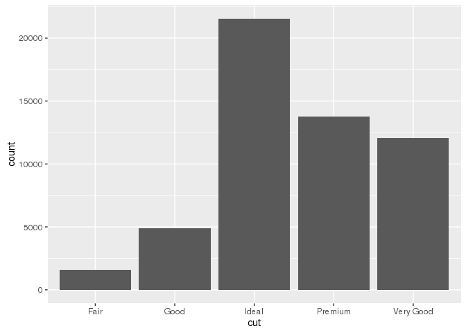
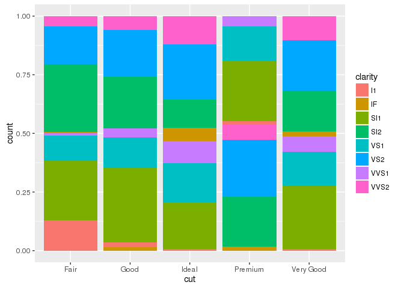
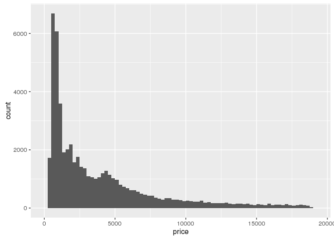
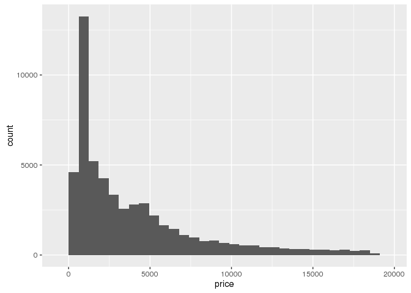
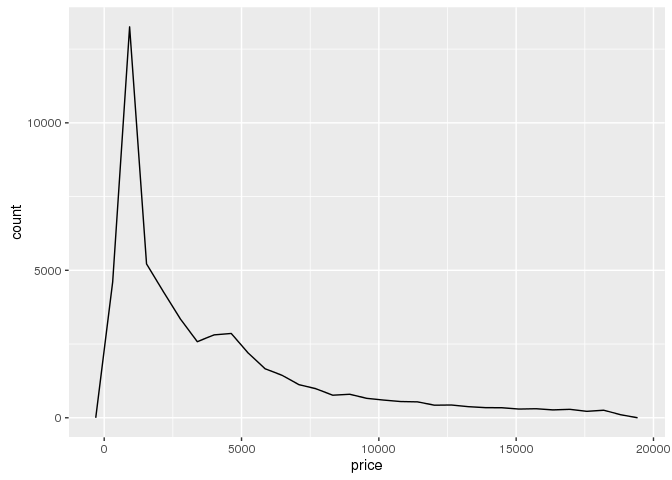
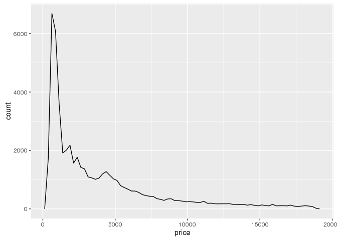
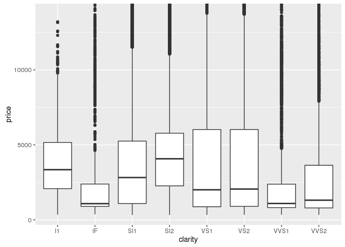
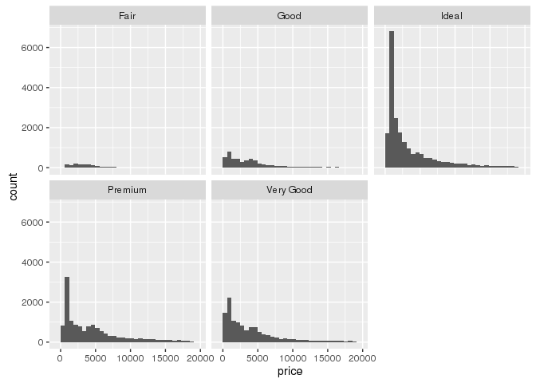
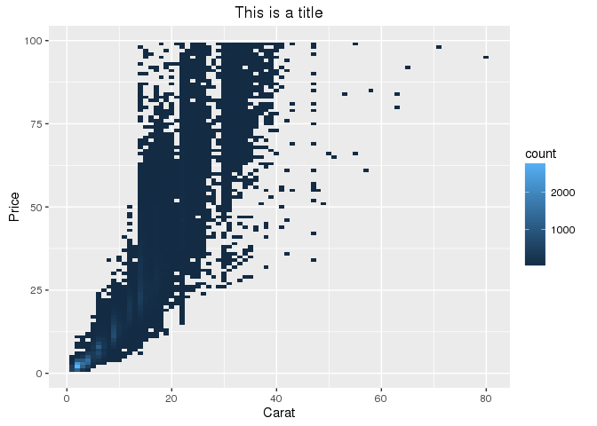
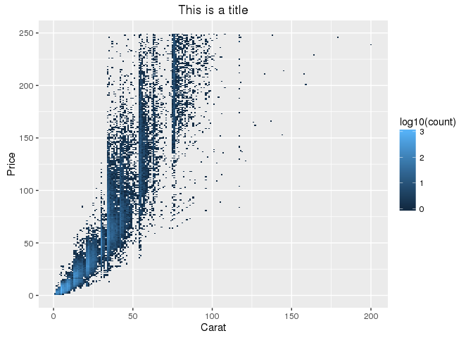

# Data Visualizations in SparkR
Sarah Armstrong, Urban Institute  
July 27, 2016  


**Objective**: In this tutorial, we illustrate various plot types that can be created in SparkR and discuss different strategies for obtaining these plots. We discuss the SparkR ggplot2 package that is in development and provide examples of plots that can be created using this package, as well as how SparkR users may develop their own functions to build visualizations. We provide examples of the following plot types:

* Bar graph
* Stacked or proportional bar graph
* Histogram
* Frequency polygon
* Bivariate histogram

**SparkR/R Operations Discussed**: `ggplot` (`ggplot2.SparkR`), `geom_bar` (`ggplot2.SparkR`), `geom_histogram` (`ggplot2.SparkR`), `geom_freqpoly` (`ggplot2.SparkR`), `geom_boxplot`, `geom_bivar_histogram.SparkR` (defined function)

***

:heavy_exclamation_mark: **Warning**: Before beginning this tutorial, please visit the SparkR Tutorials README file (found [here](https://github.com/UrbanInstitute/sparkr-tutorials/blob/master/README.md)) in order to load the SparkR library and subsequently initiate your SparkR and SparkR SQL contexts.


You can confirm that you successfully initiated these contexts by looking at the global environment of RStudio. Only proceed if you can see `sc` and `sqlContext` listed as values in the global environment or RStudio.

***

**Read in initial data as DataFrame (DF)**: Throughout this tutorial, we will use the diamonds data that is included in the `ggplot2` package and is frequently used in `ggplot2` examples. The data consists of prices and quality information about 54,000 diamonds. The data contains the four C’s of diamond quality, carat, cut, colour and clarity; and five physical measurements, depth, table, x, y and z.


```r
df <- read.df(sqlContext, "s3://ui-spark-data/diamonds.csv", header='true', delimiter=",", source="com.databricks.spark.csv", inferSchema='true', nullValue="")
cache(df)
```

We can see what the data set looks like using the `str` operation:


```r
str(df)
## 'DataFrame': 10 variables:
##  $ carat  : num 0.23 0.21 0.23 0.29 0.31 0.24
##  $ cut    : chr "Ideal" "Premium" "Good" "Premium" "Good" "Very Good"
##  $ color  : chr "E" "E" "E" "I" "J" "J"
##  $ clarity: chr "SI2" "SI1" "VS1" "VS2" "SI2" "VVS2"
##  $ depth  : num 61.5 59.8 56.9 62.4 63.3 62.8
##  $ table  : num 55 61 65 58 58 57
##  $ price  : int 326 326 327 334 335 336
##  $ x      : num 3.95 3.89 4.05 4.2 4.34 3.94
##  $ y      : num 3.98 3.84 4.07 4.23 4.35 3.96
##  $ z      : num 2.43 2.31 2.31 2.63 2.75 2.48
```

_Note_: The description of the `diamonds` data given above is adapted from http://ggplot2.org/book/qplot.pdf.


Introduced in the spring of 2016, the SparkR extension of Hadley Wickham's `ggplot2` package, `ggplot2.SparkR`, allows SparkR users to build visualizations by specifying a SparkR DataFrame and DF columns in ggplot expressions identically to how we would specify R data.frame components when using the `ggplot2` package, i.e. the extension package allows SparkR users to implement ggplot without having to modify the SparkR DataFrame API or to compute aggregations needed to build some plots.


As of the publication date of this tutorial, the `ggplot2.SparkR` package is still nascent and has identifiable bugs, including slow processing time. However, we provide `ggplot2.SparkR` in this example for its ease of use, particularly for SparkR users wanting to build basic plots. We alternatively discuss how a SparkR user may develop their own plotting function and provide an example in which we plot a bivariate histogram.


_Note_: Documentation for `ggplot2.SparkR` can be found [here](http://skku-skt.github.io/ggplot2.SparkR/), and we can view the project on GitHub [here](https://github.com/SKKU-SKT/ggplot2.SparkR). Documentation for the latest version of `ggplot2` can be found [here](http://docs.ggplot2.org/current/).

***


### Bar graph:

Just as we would when using `ggplot2`, the following expression plots a basic bar graph that gives frequency counts across the different levels of `"cut"` quality in the data:


```r
p1 <- ggplot(df, aes(x = cut))
p1 + geom_bar()
```

<!-- -->


#### Stacked or proportional bar graph:

One recognized bug within `ggplot2.SparkR` is that, when specifying a `fill` column, none of the `position` specifications--`"stack"`, `"fill"` nor `"dodge"`--necessarily return plots with constant factor-level ordering across groups. For example, the following expression successfully returns a bar graph that describes proportional frequency of `"clarity"` levels (string dtype), grouped over diamond `"cut"` types (also string dtype). Note, however, that the varied color blocks representing `"clarity"` levels are not ordered similarly across different levels of `"cut"`. The same issue results when we specify either of the other two (2) `position` specifications:


```r
p2 <- ggplot(df, aes(x = cut, fill = clarity))
p2 + geom_bar(position = "fill")
```

<!-- -->

***


### Histogram:

Just as we would when using `ggplot2`, the following expression plots a histogram that gives frequency counts across binned `"price"` values in the data:


```r
p3 <- ggplot(df, aes(price))
p3 + geom_histogram()
```

<!-- -->

The preceding histogram plot assumes the `ggplot2` default, `bins = 30`, but we can change this value or override the `bins` specification by setting a `binwidth` value as we do in the following examples:


```r
p3 + geom_histogram(binwidth = 250)
```

<!-- -->


```r
p3 + geom_histogram(bins = 100)
```

<!-- -->

***


### Frequency polygon:

Frequency polygons provide a visual alternative to histogram plots (note that they describe equivalent aggregations), and we can fit this plot type also with `ggplot2` syntax - the following expression returns a frequency polygon that is equivalent to the first histogram plotted in the preceding section:


```r
p3 + geom_freqpoly()
```

<!-- -->

Again, we can change the class intervals by specifying `binwidth` or the number of `bins` for the frequency polygon:


```r
p3 + geom_freqpoly(binwidth = 250)
```

<!-- -->


```r
p3 + geom_freqpoly(bins = 100)
```

<!-- -->

***


### Boxplot:

Finally, we can create boxplots just as we would in `ggplot2`. The following expression gives a boxplot of `"price"` values across levels of `"clarity"`:


```r
p4 <- ggplot(df, aes(x = clarity, y = price))
p4 + geom_boxplot()
```

<!-- -->

***


### Additional `ggplot2.SparkR` functionality:

We can adapt the plot types discussed in the previous sections with the specifications given below: 

* Facets: `facet_grid`, `facet_wrap` and `facet_null` (default)
* Coordinate systems: `coord_cartesian` and `coord_flip`
* Position adjustments: `position_dodge`, `position_fill`, `position_stack` (as seen in previous example)
* Scales: `scale_x_log10`, `scale_y_log10`, `labs`, `xlab`, `ylab`, `xlim` and `ylim`

For example, the following expression facets our previous histogram example across the different levels of `"cut"` quality:


```r
p3 + geom_histogram() + facet_wrap(~cut)
## `stat_bin()` using `bins = 30`. Pick better value with `binwidth`.
```

<!-- -->


### Functionality gaps between `ggplot2` and SparkR extension:

Below, we list several functions and plot types supported by `ggplot2` that are not currently supported by its SparkR extension package. The list is not exhaustive and is subject to change as the package continues to be developed:

* Weighted bar graph
* Weighted histogram
* Strictly ordered layers for filled and stacked bar graphs (as we saw in an earlier example)
* Stacked or filled histogram
* Layered frequency polygon
* Density plot using `geom_freqpoly` by specifying `y = ..density..` in aesthetic (note that the extension package does not support `geom_density`)

***


### Bivariate histogram:

In the previous examples, we relied on the `ggplot2.SparkR` package to build plots from DataFrames using syntax identical to that which we would use in a normal application of `ggplot2` on R data.frames. Given the current limitations of the extension package, we may need to develop our own function if we are interested in building a plot type that is not currently supported by `ggplot2.SparkR`. Here, we provide an example of a function that returns a bivariate histogram of two numerical DataFrame columns.


When building a function in SparkR (or any other environment), we want to avoid operations that are computationally expensive and building one that returns a plot is no different. One of the most expensive operations in SparkR, `collect`, is of particular interest when building functions that return plots since collecting data locally allows us to leverage graphing tools that we use in traditional frameworks, e.g. `ggplot2`. We should `collect` data as infrequently as possible since the operation is highly memory-intensive.


In the following function, we `collect` data five (5) times. Four of the times, we are collecting single values (two minimum and two maximum values), which does not require a huge amount of memory. The last `collect` that we perform collects a data.frame with three (3) columns and a row for each bin assignment pairing, which can fit in-memory on a single node (assuming we don't specify a massive value for `nbins`). When developing SparkR functions, we should only perform minor collections like the ones described.


```r
geom_bivar_histogram.SparkR <- function(df, x, y, nbins){
  
  library(ggplot2)
  
  x_min <- collect(agg(df, min(df[[x]]))) # Collect 1
  x_max <- collect(agg(df, max(df[[x]]))) # Collect 2
  x.bin <- seq(floor(x_min[[1]]), ceiling(x_max[[1]]), length = nbins)
  
  y_min <- collect(agg(df, min(df[[y]]))) # Collect 3
  y_max <- collect(agg(df, max(df[[y]]))) # Collect 4
  y.bin <- seq(floor(y_min[[1]]), ceiling(y_max[[1]]), length = nbins)
  
  x.bin.w <- x.bin[[2]]-x.bin[[1]]
  y.bin.w <- y.bin[[2]]-y.bin[[1]]
  
  df_ <- withColumn(df, "x_bin_", ceiling((df[[x]] - x_min[[1]]) / x.bin.w))
  df_ <- withColumn(df_, "y_bin_", ceiling((df[[y]] - y_min[[1]]) / y.bin.w))
  
  df_ <- mutate(df_, x_bin = ifelse(df_$x_bin_ == 0, 1, df_$x_bin_))
  df_ <- mutate(df_, y_bin = ifelse(df_$y_bin_ == 0, 1, df_$y_bin_))
  
  dat <- collect(agg(groupBy(df_, "x_bin", "y_bin"), count = n(df_$x_bin))) # Collect 5
  
  p <- ggplot(dat, aes(x = x_bin, y = y_bin, fill = count)) + geom_tile()
  
  return(p)
}
```

Here, we evaluate the `geom_bivar_histogram.SparkR` function using `"carat"` and `"price"`:


```r
p5 <- geom_bivar_histogram.SparkR(df = df, x = "carat", y = "price", nbins = 100)
p5 + scale_colour_brewer(palette = "Blues", type = "seq") + ggtitle("This is a title") + xlab("Carat") + ylab("Price")
```

<!-- -->

_Note_: Documentation for the `geom_bivar_histogram.SparkR` function is given [here](https://github.com/UrbanInstitute/sparkr-tutorials/blob/master/R/geom_bivar_histogram_SparkR.R).


Note that the plot closely resembles a scatterplot. Bivariate histograms are one strategy for mitigating the overplotting that often occurs when attempting to visualize apparent correlation between two (2) columns in massive data sets. Furthermore, it is sometimes impossible to gather the data that is necessary to map individual points to a scatterplot onto a single node within our cluster - this is when aggregation becomes necessary rather than simply preferable. Just like plotting a univariate histogram, binning data reduces the number of points to plot and, with the appropriate choice of bin number and color scale, bivariate histograms can provide an intuitive alternative to scatterplots when working with massive data sets.


For example, the following function is equivalent to our previous one, but we have changed the `fill` specification that determines the color scale from `count` to `log10(count)`. Then, we evaluate the new function with a larger `nbins` value, returning a new plot with more granular binning and a more nuanced color scale (since the breaks in the color scale are now log10-spaced).


```r
geom_bivar_histogram.SparkR.log10 <- function(df, x, y, nbins){
  
  library(ggplot2)
  
  x_min <- collect(agg(df, min(df[[x]])))
  x_max <- collect(agg(df, max(df[[x]])))
  x.bin <- seq(floor(x_min[[1]]), ceiling(x_max[[1]]), length = nbins)
  
  y_min <- collect(agg(df, min(df[[y]])))
  y_max <- collect(agg(df, max(df[[y]])))
  y.bin <- seq(floor(y_min[[1]]), ceiling(y_max[[1]]), length = nbins)
  
  x.bin.w <- x.bin[[2]]-x.bin[[1]]
  y.bin.w <- y.bin[[2]]-y.bin[[1]]
  
  df_ <- withColumn(df, "x_bin_", ceiling((df[[x]] - x_min[[1]]) / x.bin.w))
  df_ <- withColumn(df_, "y_bin_", ceiling((df[[y]] - y_min[[1]]) / y.bin.w))
  
  df_ <- mutate(df_, x_bin = ifelse(df_$x_bin_ == 0, 1, df_$x_bin_))
  df_ <- mutate(df_, y_bin = ifelse(df_$y_bin_ == 0, 1, df_$y_bin_))
  
  dat <- collect(agg(groupBy(df_, "x_bin", "y_bin"), count = n(df_$x_bin)))
  
  p <- ggplot(dat, aes(x = x_bin, y = y_bin, fill = log10(count))) + geom_tile()
  
  return(p)
}
```

We now evaluate the `geom_bivar_histogram.SparkR.log10` function with `"carat"` and `"price"`:


```r
p6 <- geom_bivar_histogram.SparkR.log10(df = df, x = "carat", y = "price", nbins = 250)
p6 + scale_colour_brewer(palette = "Blues", type = "seq") + ggtitle("This is a title") + xlab("Carat") + ylab("Price")
```

<!-- -->


__End of tutorial__ - Next up is [Insert next tutorial]
